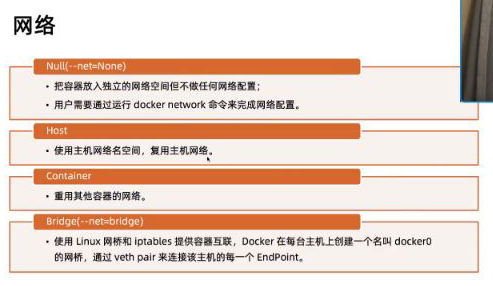
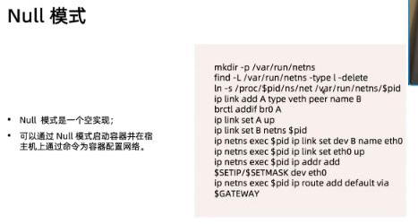

= docker network

[source,shell script]
----
docker_bridge_name=docker-bridge

docker network create ${docker_bridge_name} \
    -o com.docker.network.bridge.name=${docker_bridge_name}

firewall-cmd --permanent --zone=trusted --remove-interface=docker-bridge
firewall-cmd --reload

----

默认 null

